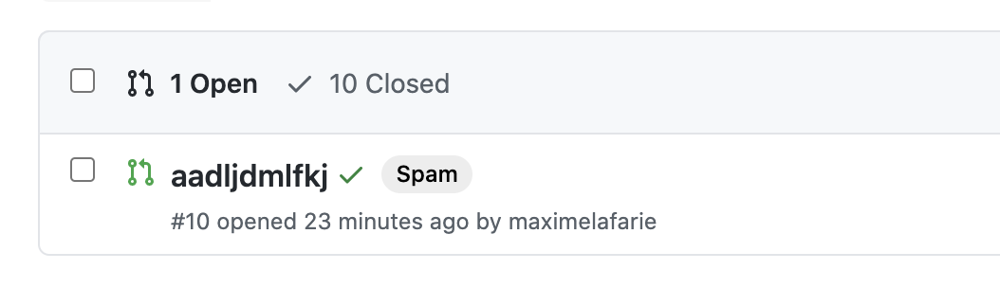
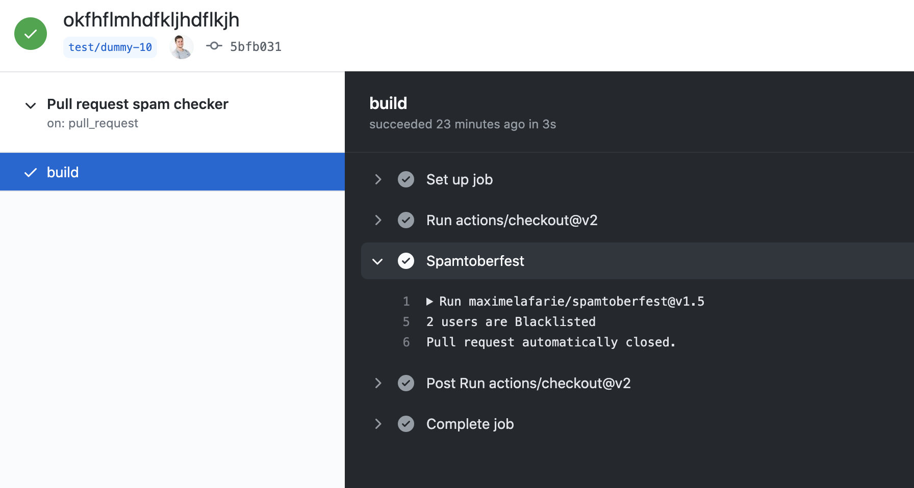
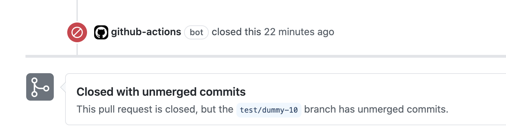

# Spamtoberfest ☠️

## What is it
This project was created in order to fight against spammers who are rotting what Hacktoberfest was created for.

This project consists of two parts: 
- One part to list users who spam
- A part to provide those who wish to do so with a GitHub Action to automatically clean their repositories, based on the list of spammers.

You can either flag some suspicious PRs or directly close and flag them if the author is recorded into the spammers list (in addition, it will not be taken into account for the Hacktoberfest achievements).

## How to add somebody to the spammers list?
1. Open an issue with the dedicated issue template and fill the required fields
2. Somebody will take a look at your issue and will push it or not to the repo's blacklist

## The philosophy, why no PRs?
Any issue doesn't open a PR. We only direct-push to the repo to not "cheat" over the Hacktoberfest event.

**I would like to avoid that contributing to the list to preserve our projects and our time becomes a PR race.**

## And so what?
We hope this list, when completed with some spammers who don't care that much about the wonderful open source world, will help some maintainers to waste less time closing useless PRs opened by idiots that just want a t-shirt without caring about what they contribute.

## Add the Spamtoberfest Action to your repository
In order to use the Action, you need to add a `workflow` to your project.

### Create Workflow
Create a workflow (eg: `.github/workflows/spamtoberfest.yml` see [Creating a Workflow file](https://help.github.com/en/articles/configuring-a-workflow#creating-a-workflow-file)) to utilize the spamtoberfest action with content:

```yml
name: Pull Request Spamtoberfest checker

on:
  pull_request:
    types: [opened]

jobs:
  triage:
    runs-on: ubuntu-latest
    steps:
      - uses: actions/checkout@v2
      - name: Spamtoberfest
        uses: maximelafarie/spamtoberfest@main
        with:
          action-type: close # default is flag
          repo-token: ${{ secrets.GITHUB_TOKEN }}
```

You also can take a look at our [workflow demo file](.github/workflows/main.yml).

_Note: This grants access to the `GITHUB_TOKEN` so the action can make calls to GitHub's rest API_

#### Inputs

Various inputs are defined in [`action.yml`](action.yml) to let you configure Spamtoberfest:

| Name | Description | Default |
| - | - | - |
| `repo-token` | Token to use to authorize label changes. Typically the GITHUB_TOKEN secret | N/A |
| `action-type` | The action to be taken in case of a positive test. Possible values are `flag` (adds a "Spam" label to the PR) and `close` (adds a "Spam" label to the PR and closes it). | `flag`

## Contributing
You want to make the script even faster, the model more sexy? Any **real** contribution to the repo (**not** on the blacklist) should be made with a PR as you would do for a standard GitHub project. More info on the [CONTRIBUTING.md](CONTRIBUTING.md) file. 😉

#### `npm run start:dev`
Starts the application in development using `nodemon` and `ts-node` to do hot reloading.

#### `npm run build`
Builds the app at `build`, cleaning the folder first.

#### `npm run start`
Starts the app in production by first building the project with `npm run build`, and then executing the compiled JavaScript at `build/index.js`.

## Screenshots
#### Automatic labelling
<div>
    
    
</div>

#### Automatic closing
<div>
    
    
</div>
